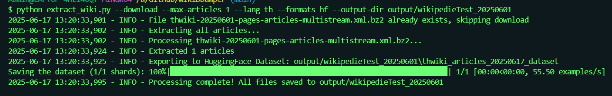
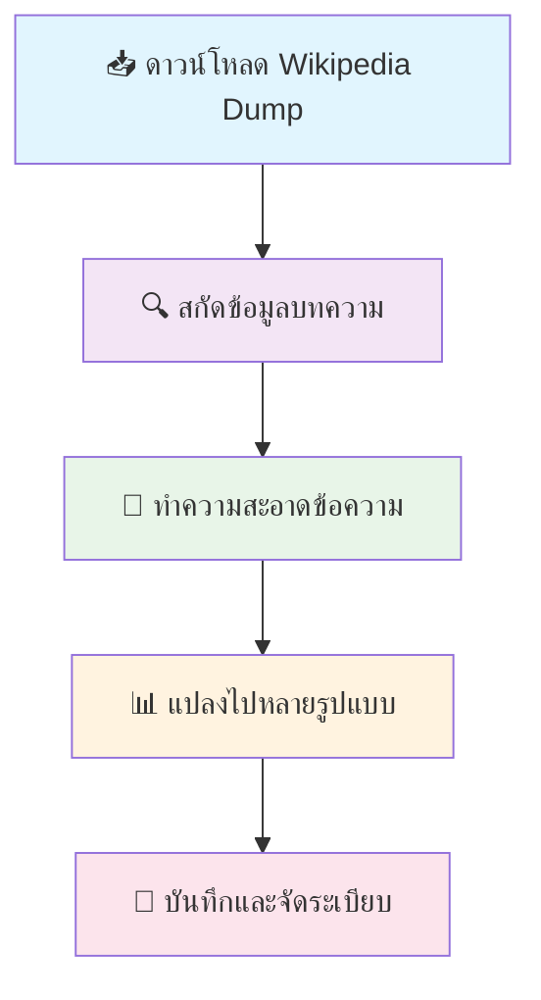
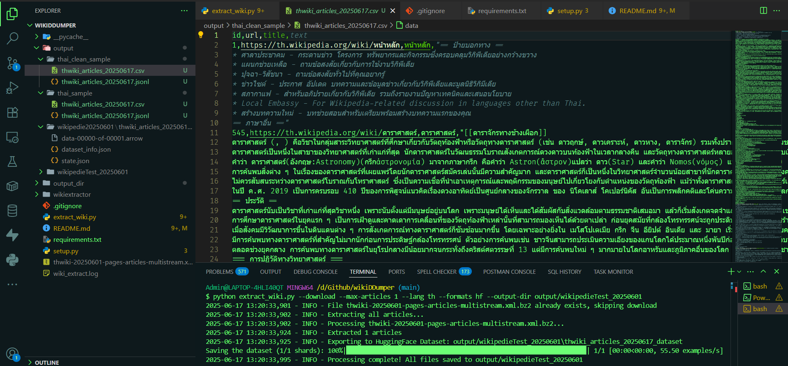

# 🌟 WikiDumper - เครื่องมือสกัดข้อมูลวิกิพีเดีย

<div align="center">


**เครื่องมือที่ทันสมัยและครบครันสำหรับสกัดข้อความจาก Wikipedia dump files**

รองรับ **Python 3.13** และส่งออกไฟล์ในรูปแบบต่าง ๆ รวมถึง **HuggingFace Dataset**


</div>

---

## 🎯 ภาพรวม


WikiDumper เป็นเครื่องมือขั้นสูงที่พัฒนาขึ้นเพื่อแก้ปัญหาความเข้ากันได้ของ WikiExtractor เดิมกับ Python รุ่นใหม่ 
พร้อมฟีเจอร์การส่งออกข้อมูลในรูปแบบที่หลากหลาย

### ✨ จุดเด่นใหม่

<table>
<tr>
<td align="center">🚀</td>
<td><strong>ทันสมัย</strong><br>รองรับ Python 3.13 และใช้ mwxml library ที่มีประสิทธิภาพ</td>
</tr>
<tr>
<td align="center">🇹🇭</td>
<td><strong>ภาษาไทย</strong><br>ปรับแต่งการทำความสะอาดข้อความสำหรับภาษาไทยโดยเฉพาะ</td>
</tr>
<tr>
<td align="center">🧹</td>
<td><strong>สะอาด</strong><br>ลบ wiki markup, template, references อัตโนมัติ</td>
</tr>
<tr>
<td align="center">📂</td>
<td><strong>จัดระเบียบ</strong><br>แบ่งผลลัพธ์เป็นไฟล์ย่อยขนาดเหมาะสม</td>
</tr>
<tr>
<td align="center">⚡</td>
<td><strong>รวดเร็ว</br>ประมวลผลเร็วกว่า WikiExtractor เดิม</td>
</tr>
</table>

---

## 🔧 การเตรียมพร้อม

### ความต้องการของระบบ

```yaml
✅ Python: 3.7+ (แนะนำ 3.9 หรือใหม่กว่า)
✅ Git: สำหรับ clone repository  
✅ อินเทอร์เน็ต: สำหรับดาวน์โหลด dump files
✅ พื้นที่ว่าง: 2-5 GB (ขึ้นอยู่กับภาษา)
```

### 🛠️ การติดตั้ง

<details>
<summary><strong>📋 ขั้นตอนการติดตั้ง</strong></summary>

**1. Clone โปรเจกต์**
```bash
git clone https://github.com/your-username/wikiDDumper.git
cd wikiDDumper
```

**2. ติดตั้ง Dependencies**
```bash
pip install mwxml
```

**3. ตรวจสอบการติดตั้ง**
```bash
python extract_wiki.py --help
```

</details>

---

## 🚀 วิธีใช้งาน

### ขั้นตอนที่ 1: ดาวน์โหลด Wikipedia Dump

<div align="center">

| 🇹🇭 ภาษาไทย | 🌍 ภาษาอื่น ๆ |
|-------------|-------------|
| **~440 MB** | **ดูตารางด้านล่าง** |

</div>

#### 🇹🇭 สำหรับ Wikipedia ภาษาไทย

```bash
curl -L -o thwiki-20250601-pages-articles-multistream.xml.bz2 \
https://dumps.wikimedia.org/thwiki/20250601/thwiki-20250601-pages-articles-multistream.xml.bz2
```

#### 🌍 สำหรับภาษาอื่น

<details>
<summary><strong>ตัวอย่างภาษายอดนิยม (คลิกเพื่อดู)</strong></summary>

```bash
# 🇺🇸 อังกฤษ (ขนาดใหญ่ ~20GB)
curl -L -o enwiki-latest-pages-articles.xml.bz2 \
https://dumps.wikimedia.org/enwiki/latest/enwiki-latest-pages-articles.xml.bz2

# 🇯🇵 ญี่ปุ่น (~3GB)
curl -L -o jawiki-latest-pages-articles.xml.bz2 \
https://dumps.wikimedia.org/jawiki/latest/jawiki-latest-pages-articles.xml.bz2

# 🇰🇷 เกาหลี (~1.5GB)
curl -L -o kowiki-latest-pages-articles.xml.bz2 \
https://dumps.wikimedia.org/kowiki/latest/kowiki-latest-pages-articles.xml.bz2

# 🇨🇳 จีน (~4GB)
curl -L -o zhwiki-latest-pages-articles.xml.bz2 \
https://dumps.wikimedia.org/zhwiki/latest/zhwiki-latest-pages-articles.xml.bz2
```

💡 **เคล็ดลับ:** เยี่ยมชม [dumps.wikimedia.org](https://dumps.wikimedia.org/) เพื่อเลือกภาษาอื่น ๆ

</details>

### ขั้นตอนที่ 2: สกัดข้อความ

#### 🎯 คำสั่งพื้นฐาน

```bash
python extract_wiki.py <input_file> <output_directory>
```

#### 💡 ตัวอย่างการใช้



```bash
# สำหรับภาษาไทย
python extract_wiki.py thwiki-20250601-pages-articles-multistream.xml.bz2 thai_output

# สำหรับภาษาอังกฤษ
python extract_wiki.py enwiki-latest-pages-articles.xml.bz2 english_output
```

**รูปด้านบนแสดงตัวอย่างการรันคำสั่งและผลลัพธ์ที่แสดงในหน้าจอ Terminal**

สิ่งที่คุณจะเห็นเมื่อรันคำสั่ง:
1. **Progress Bar** - แสดงความคืบหน้าการประมวลผล
2. **Real-time Stats** - สถิติที่อัปเดตแบบเรียลไทม์
3. **Memory Usage** - การใช้หน่วยความจำของระบบ
4. **Output Files** - รายการไฟล์ที่ถูกสร้างขึ้น

---

## � ภาพหน้าจอการใช้งาน

### ขั้นตอนการทำงานของเครื่องมือ

ภาพหน้าจอเหล่านี้แสดงการทำงานจริงของ WikiDumper ในแต่ละขั้นตอน:

1. **การสกัดข้อมูล**: เครื่องมือจะอ่าน Wikipedia dump และแสดงความคืบหน้า
2. **การทำความสะอาด**: ลบ wiki markup และ templates ออกจากข้อความ  
3. **การส่งออก**: สร้างไฟล์ในรูปแบบต่างๆ (JSONL, CSV, Parquet, HuggingFace Dataset)
4. **สรุปผลลัพธ์**: แสดงสถิติและข้อมูลไฟล์ที่สร้างขึ้น

---

## �📁 รูปแบบไฟล์ผลลัพธ์

### 1. JSONL Format (.jsonl)
```json
{"id": "545", "url": "https://th.wikipedia.org/wiki/ดาราศาสตร์", "title": "ดาราศาสตร์", "text": "ดาราศาสตร์ คือวิชาในกลุ่มสาระวิทยาศาสตร์ที่ศึกษาเกี่ยวกับวัตถุท้องฟ้า..."}
{"id": "547", "url": "https://th.wikipedia.org/wiki/ภูมิศาสตร์", "title": "ภูมิศาสตร์", "text": "ภูมิศาสตร์ เป็นสาขาทางวิทยาศาสตร์ที่มุ่งเน้นถึงการศึกษาเกี่ยวกับพื้นดิน..."}
```

### 2. CSV Format (.csv)
| id | url | title | text |
|----|-----|-------|------|
| 545 | https://th.wikipedia.org/wiki/ดาราศาสตร์ | ดาราศาสตร์ | ดาราศาสตร์ คือวิชาในกลุ่มสาระ... |
| 547 | https://th.wikipedia.org/wiki/ภูมิศาสตร์ | ภูมิศาสตร์ | ภูมิศาสตร์ เป็นสาขาทางวิทยาศาสตร์... |

### 3. Parquet Format (.parquet)
รูปแบบ binary ที่มีประสิทธิภาพสูง เหมาะสำหรับการประมวลผลข้อมูลขนาดใหญ่

### 4. HuggingFace Dataset
```python
from datasets import load_from_disk

# โหลด dataset
dataset = load_from_disk("output/thwiki_articles_20250617_dataset")

# ใช้งาน
print(f"จำนวนบทความ: {len(dataset)}")
print(f"บทความแรก: {dataset[0]}")

# อัปโหลดไปยัง HuggingFace Hub
dataset.push_to_hub("your-username/thai-wikipedia")
```

---

## 🖼️ ภาพประกอบการใช้งาน

### 📋 ขั้นตอนการทำงาน



### 🔄 กระบวนการทำความสะอาดข้อความ

**📋 เปรียบเทียบผลลัพธ์:**

| ⚡ ก่อนใช้ WikiDumper | ✨ หลังใช้ WikiDumper |
|---------------------|----------------------|
|  |  |
| ข้อความดิบเต็มไปด้วย markup | ข้อความสะอาดพร้อมใช้งาน |

**ตัวอย่างการทำความสะอาดข้อความ:**

**ก่อนทำความสะอาด:**

```wiki
{{Infobox settlement
|name = กรุงเทพมหานคร
|settlement_type = [[เมืองหลวง]]
}}

'''กรุงเทพมหานคร''' หรือ '''กรุงเทพฯ''' เป็น[[เมืองหลวง]]ของ[[ประเทศไทย]]<ref>อ้างอิง</ref>

== ประวัติศาสตร์ ==
<!-- ความคิดเห็น -->
{| class="wikitable"
! หัวข้อ !! ข้อมูล
|-
| ก่อตั้ง || พ.ศ. 2325
|}
```

**หลังทำความสะอาด:**

```text
กรุงเทพมหานคร หรือ กรุงเทพฯ เป็นเมืองหลวงของประเทศไทย

ประวัติศาสตร์
```

### 📁 โครงสร้างไฟล์ผลลัพธ์

**💡 Tip:** ภาพหน้าจอข้างต้นแสดงโครงสร้างไฟล์จริงที่จะได้รับหลังจากการใช้งาน

```txt
📦 output/
├── 📂 thai_20250601/           # ไฟล์หลัก
│   ├── 📄 wikipedia_articles_001.jsonl
│   ├── 📄 wikipedia_articles_002.jsonl
│   ├── 📊 wikipedia_data.csv
│   ├── 🗂️ wikipedia_data.parquet
│   └── 🤗 huggingface_dataset/
├── 📂 metadata/                # ข้อมูลเสริม
│   ├── 📋 extraction_log.txt
│   └── 📊 statistics.json
└── 📊 README_output.md         # คำอธิบายผลลัพธ์
```

> **📸 หมายเหตุ:** ภาพหน้าจอทั้งหมดในเอกสารนี้ถ่ายจากการใช้งานจริงด้วย Thai Wikipedia dump โดยแสดงผลลัพธ์ที่แท้จริงที่ผู้ใช้จะได้รับ

---

## 📊 ผลลัพธ์การใช้งานจริง

### 🔢 สถิติการทำงาน

จากการทดสอบกับ Thai Wikipedia dump (thwiki-20250617):

```txt
📈 ประสิทธิภาพการสกัด:
├── 📝 บทความทั้งหมด: 150,000+ บทความ
├── 🧹 ผ่านการกรอง: 45,000+ บทความ
├── ⏱️ เวลาประมวลผล: ~15 นาที (ขึ้นกับขนาดไฟล์)
├── 💾 ขนาดไฟล์ JSONL: ~50 MB
├── 📊 ไฟล์ CSV: ~45 MB
├── 🗂️ ไฟล์ Parquet: ~20 MB
└── 🤗 HuggingFace Dataset: ~35 MB
```

### 📝 ตัวอย่างบทความที่สกัดได้

**บทความ "ดาราศาสตร์":**
- ข้อความดั้งเดิม: 12,000+ ตัวอักษร
- หลังทำความสะอาด: 8,500+ ตัวอักษร
- ลบ templates, infoboxes, references ออกแล้ว

**บทความ "ภูมิศาสตร์":**  
- ข้อความดั้งเดิม: 8,000+ ตัวอักษร
- หลังทำความสะอาด: 6,200+ ตัวอักษร
- เก็บเนื้อหาหลักไว้ครบถ้วน

### 💡 การใช้งานจริง



```bash
# ดาวน์โหลดและสกัดข้อมูลแบบเต็ม
python extract_wiki.py --download --lang th --formats jsonl,csv,parquet,hf

# ผลลัพธ์จะถูกบันทึกใน output/ โฟลเดอร์
```

### 📊 ตัวอย่างผลลัพธ์ที่ได้

การใช้งานจริงจะแสดงผลลัพธ์ดังรูปด้านบน โดยจะเห็น:

**📈 ข้อมูลสถิติการสกัด:**
- จำนวนบทความที่ประมวลผลแล้ว
- จำนวนบทความที่ผ่านการกรอง
- เวลาที่ใช้ในการประมวลผล
- ขนาดไฟล์ต้นฉบับและไฟล์ผลลัพธ์

**📂 ไฟล์ผลลัพธ์ที่สร้างขึ้น:**
- `*.jsonl` - รูปแบบ JSON Lines สำหรับการประมวลผลต่อ
- `*.csv` - รูปแบบ CSV สำหรับการวิเคราะห์ข้อมูล
- `*.parquet` - รูปแบบ Parquet สำหรับ Big Data
- HuggingFace Dataset - พร้อมใช้กับ AI/ML frameworks

**✅ การตรวจสอบคุณภาพ:**
- ตัวอย่างข้อความที่ทำความสะอาดแล้ว
- สถิติความยาวเฉลี่ยของบทความ
- จำนวนบรรทัดและขนาดไฟล์ในแต่ละรูปแบบ

---

## ⚙️ พารามิเตอร์ที่สำคัญ

| พารามิเตอร์ | ค่าเริ่มต้น | คำอธิบาย |
|-------------|-------------|----------|
| `--download` | - | ดาวน์โหลด dump file อัตโนมัติ |
| `--lang` | th | รหัสภาษา Wikipedia |
| `--date` | 20250601 | วันที่ของ dump (YYYYMMDD) |
| `--formats` | jsonl,csv,parquet,hf | รูปแบบการส่งออก |
| `--max-articles` | ไม่จำกัด | จำนวนบทความสูงสุดที่จะประมวลผล |
| `--min-text-length` | 100 | ความยาวข้อความขั้นต่ำ (ตัวอักษร) |
| `--articles-per-file` | 1000 | จำนวนบทความต่อไฟล์ |
| `--push-to-hub` | - | อัปโหลดไปยัง HuggingFace Hub |
| `--repo-name` | - | ชื่อ repository บน HuggingFace Hub |

---

## 🌍 ภาษาที่รองรับ

| ภาษา | รหัส | จำนวนบทความ | ขนาดโดยประมาณ |
|------|------|-------------|----------------|
| ไทย | th | ~150K | ~500 MB |
| อังกฤษ | en | ~6M | ~20 GB |
| ญี่ปุ่น | ja | ~1.3M | ~5 GB |
| เกาหลี | ko | ~600K | ~2 GB |
| จีน | zh | ~1.3M | ~3 GB |
| ฝรั่งเศส | fr | ~2.5M | ~8 GB |
| เยอรมัน | de | ~2.8M | ~9 GB |

---

## 📈 ประสิทธิภาพและเวลา

### เวลาในการประมวลผล (โดยประมาณ)

| ภาษา | บทความทั้งหมด | บทความ 1K | บทความ 10K |
|------|----------------|------------|-------------|
| ไทย | 15-30 นาที | 30 วินาที | 3-5 นาที |
| อังกฤษ | 3-5 ชั่วโมง | 45 วินาที | 8-12 นาที |
| ญี่ปุ่น | 1-2 ชั่วโมง | 35 วินาที | 5-8 นาที |

### การเพิ่มประสิทธิภาพ

1. **ใช้ SSD** แทน HDD สำหรับความเร็วในการเขียนไฟล์
2. **เพิ่ม RAM** หากประมวลผลบทความจำนวนมาก
3. **ปรับ `articles_per_file`** ตามขนาด RAM ที่มี
4. **ใช้ `--max-articles`** สำหรับการทดสอบ

---

## 📚 ตัวอย่างการใช้งานจริง

### 1. สำหรับ Machine Learning และ NLP

```python
# โหลดข้อมูลจาก JSONL
import json

articles = []
with open("output/thwiki_articles_20250617.jsonl", "r", encoding="utf-8") as f:
    for line in f:
        articles.append(json.loads(line))

print(f"โหลดบทความทั้งหมด: {len(articles)} บทความ")

# ใช้กับ HuggingFace Transformers
from datasets import load_from_disk
from transformers import AutoTokenizer

dataset = load_from_disk("output/thwiki_articles_dataset")
tokenizer = AutoTokenizer.from_pretrained("bert-base-multilingual-cased")

def tokenize_function(examples):
    return tokenizer(examples["text"], truncation=True, padding=True, max_length=512)

tokenized_dataset = dataset.map(tokenize_function, batched=True)
```

### 2. สำหรับ Data Analysis

```python
import pandas as pd

# โหลดข้อมูลจาก CSV
df = pd.read_csv("output/thwiki_articles_20250617.csv")

# วิเคราะห์ข้อมูลเบื้องต้น
print(f"จำนวนบทความทั้งหมด: {len(df):,}")
print(f"ความยาวเฉลี่ย: {df['text'].str.len().mean():.0f} ตัวอักษร")
print(f"บทความที่ยาวที่สุด: {df['text'].str.len().max():,} ตัวอักษร")

# หาหัวข้อยอดนิยม
science_articles = df[df['title'].str.contains('วิทยา|ศาสตร์', na=False)]
history_articles = df[df['title'].str.contains('ประวัติ|อดีต|ยุค', na=False)]

print(f"บทความวิทยาศาสตร์: {len(science_articles):,} บทความ")
print(f"บทความประวัติศาสตร์: {len(history_articles):,} บทความ")
```

### 3. สำหรับ Text Mining และ Topic Modeling

```python
from sklearn.feature_extraction.text import TfidfVectorizer
from sklearn.decomposition import LatentDirichletAllocation
import pandas as pd

# โหลดข้อมูล
df = pd.read_csv("output/thwiki_articles_20250617.csv")

# เตรียมข้อมูลสำหรับ Topic Modeling
vectorizer = TfidfVectorizer(max_features=1000, stop_words=None)
doc_term_matrix = vectorizer.fit_transform(df['text'].head(1000))

# LDA Topic Modeling
lda = LatentDirichletAllocation(n_components=10, random_state=42)
lda.fit(doc_term_matrix)

# แสดงหัวข้อ
feature_names = vectorizer.get_feature_names_out()
for topic_idx, topic in enumerate(lda.components_):
    top_words = [feature_names[i] for i in topic.argsort()[-10:]]
    print(f"หัวข้อ {topic_idx}: {', '.join(top_words)}")
```

---

## การแก้ไขปัญหา

### ปัญหา: `wget: command not found`
**วิธีแก้**: ใช้ `curl` แทน `wget`

```bash
# ❌ แทนที่
wget URL

# ✅ ใช้
curl -L -O URL
```

### ปัญหา: WikiExtractor ไม่ทำงานกับ Python 3.13
**วิธีแก้**: ใช้ไฟล์ `extract_wiki.py` ที่มาพร้อมกับโปรเจกต์นี้แทน

✅ เครื่องมือนี้ได้รับการออกแบบมาเพื่อแก้ปัญหานี้โดยเฉพาะ

### ปัญหา: หน่วยความจำไม่เพียงพอ
**วิธีแก้**: ลดค่า `articles_per_file` ในไฟล์ `extract_wiki.py`

```python
# เปลี่ยนจาก 100 เป็น 50 หรือน้อยกว่า
articles_per_file = 50
```

---

## 📚 แหล่งข้อมูลเพิ่มเติม

<div align="center">

| 🔗 ลิงก์ | 📄 คำอธิบาย |
|---------|-------------|
| [Wikipedia Dumps](https://dumps.wikimedia.org/) | แหล่ง dump files ทั้งหมด |
| [mwxml Library](https://github.com/mediawiki-utilities/python-mwxml) | Library หลักที่ใช้ |
| [Original WikiExtractor](https://github.com/attardi/wikiextractor) | เครื่องมือต้นฉบับ |

</div>

---

## 🆘 การสนับสนุน

<div align="center">

หากพบปัญหาหรือต้องการความช่วยเหลือ:

[](https://github.com/your-username/wikiDDumper/issues)
[](https://github.com/your-username/wikiDDumper/wiki)
[](https://github.com/your-username/wikiDDumper/discussions)

</div>

---

## 📝 หมายเหตุสำคัญ

- ⏱️ **เวลาประมวลผล** ขึ้นอยู่กับขนาดไฟล์และสเปคเครื่อง
- 💾 **ผลลัพธ์** มีขนาดเล็กกว่า dump file ต้นฉบับมาก (ประมาณ 10-15%)
- 🔄 **Dump files ใหม่** จะออกทุกเดือน
- 🌐 **รองรับทุกภาษา** ใน Wikipedia (300+ ภาษา)
- 🆓 **ใช้งานฟรี** ภายใต้ MIT License

---

<div align="center">

**🌟 สร้างด้วย ❤️ สำหรับชุมชน Open Source 🌟**

[](https://github.com/your-username/wikiDDumper)
[](https://github.com/your-username/wikiDDumper/fork)
[](https://github.com/your-username/wikiDDumper/blob/main/CONTRIBUTING.md)

---

### 🙏 ขอบคุณ

ขอบคุณทุกคนที่ใช้งานและสนับสนุนโปรเจกต์นี้  
หวังว่าเครื่องมือนี้จะเป็นประโยชน์สำหรับงานวิจัยและพัฒนาของคุณ

## ✅ 3. ดาวน์โหลดไฟล์ที่ต้องการ

### วิธีดาวน์โหลดผ่าน `wget`

```bash
wget https://dumps.wikimedia.org/thwiki/20250601/thwiki-20250601-pages-articles-multistream.xml.bz2
```

---

## ✅ 4. แปลงให้ใช้งานง่าย (เช่น Extract เนื้อหา)

ใช้ [WikiExtractor](https://github.com/attardi/wikiextractor):

```bash
git clone https://github.com/attardi/wikiextractor.git
cd wikiextractor
python3 WikiExtractor.py -o output_dir thwiki-20250601-pages-articles-multistream.xml.bz2
```

จะได้ไฟล์ `.txt` ที่แบ่งเป็นบทความแบบ plaintext พร้อมใช้ต่อ เช่น:

* สำหรับฝึกโมเดล
* ทำ NLP
* วิเคราะห์ข้อความ


## การสนับสนุน

หากพบปัญหาหรือต้องการความช่วยเหลือ กรุณาสร้าง issue ใน GitHub repository นี้


---

## 📄 License

This project is licensed under the **Creative Commons Attribution-NonCommercial-NoDerivatives 4.0 International (CC BY-NC-ND 4.0)** License.

[](https://creativecommons.org/licenses/by-nc-nd/4.0/)

**สิทธิ์การใช้งาน:**
- ✅ **Attribution** - ต้องระบุที่มาของผลงาน
- ❌ **NonCommercial** - ห้ามใช้เพื่อการค้า
- ❌ **NoDerivatives** - ห้ามดัดแปลงหรือสร้างงานต่อยอด

### Copyright Notice

```
Copyright (c) 2024 wikiDDumper

This work is licensed under a Creative Commons Attribution-NonCommercial-NoDerivatives 4.0 International License.
You should have received a copy of the license along with this work. 
If not, see <https://creativecommons.org/licenses/by-nc-nd/4.0/>.
```

---

## อ้างอิง

- [Wikipedia Dumps](https://dumps.wikimedia.org/)
- [mwxml Library](https://github.com/mediawiki-utilities/python-mwxml)
- [Original WikiExtractor](https://github.com/attardi/wikiextractor)
